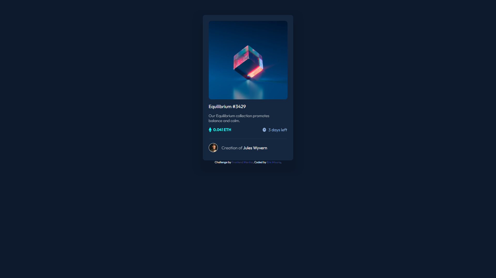

# Frontend Mentor - NFT preview card component solution

This is a solution to the [NFT preview card component challenge on Frontend Mentor](https://www.frontendmentor.io/challenges/nft-preview-card-component-SbdUL_w0U). Frontend Mentor challenges help you improve your coding skills by building realistic projects.

## The challenge

Users should be able to:

- View the optimal layout depending on their device's screen size
- See hover states for interactive elements
## Screenshots

## Links
- Solution URL: [Solution](https://www.frontendmentor.io/solutions/nft-preview-card-Dg1Jak-Yv6)
- Live Site URL: [Live Site](https://nft-preview-card-red-xi.vercel.app/)
## Built with
- Semantic HTML5 markup
- CSS custom properties
- Flexbox
- CSS Grid
- Mobile-first workflow
## Author

- Website - [Eric Moura](https://emouradev.vercel.app/)
- Frontend Mentor - [@xXAxiomaXx](https://www.frontendmentor.io/profile/xXAxiomaXx)

